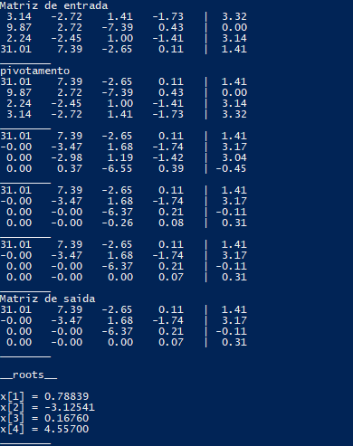

# metodoGauss
Uso do método de eliminação de Gauss para achar raízes de sistemas de equação lineares

# O método de eliminação de Gauss

É um procedimento usada para resolver sistemas de equações lineares. Ele consiste em aplicar sucessivas operações elementares num sistema de equações genericos até apresentar a forma *triangular superior*, que apresenta exatamente as mesmas soluções que o original, é então resolvida com emprego da substituição regressiva.

# Pivotamento

A pivotação e normalmente usado no método Guass para evitar os seguintes problemas:
* O elemento pivo é zero. Quando isso acontece o método falha pois não é possivel calcular a solução mesmo que o sistemas tenha raizes
* O elemento pivô é pequeno em relação aos demais termos na linha pivô. Erros de arredondamento significativos podem ocorrer quando o elemento pivô é pequeno em relação aos demais elementos na linha pivô resultando em uma solução errada

O pivotamento consiste  em trocar a linha da matriz com o pivo que apresenta um dos problemas listados acima com outra linha não nula abaixo desta que siga a seguinte relação 
>											a_ji > a_ii

onde a_ji e o elemento de uma das linhas abaixo da linha pivo, e a_ii o elemento pivo

Em geral, obtém-se uma solução mais precisa quando as equações são arranjadas (e rearranjadas cada vez que uma nova equação pivô é utilizada) de tal forma que a equação pivô tenha o maior elemento pivô possível

Se durante o procedimento de eliminação de Gauss uma equação pivô tiver um elemento pivô nulo e o sistema de equações sendo resolvido tiver solução, uma equação com um elemento pivô diferente de zero sempre poderá ser encontrada.

# Codigo

``` c
#include <stdio.h>
#include <stdlib.h>
#include <math.h>

void imprimeMatrizCompleta(double **m, int dim);

void memcpy_d(double *dest, double *src, int _size)
{
	int i;
	
	for(i = 0; i< _size ;i++)
	{
		dest[i] = src[i];
	}
} 

double *substituicaoRegressiva(double **m, int dim)
{
    double *root = (double*)malloc(dim * sizeof(double));
    double sum;
    int i,j,n;

    n = dim - 1;
    root[n] = m[n][dim]/(double)m[n][n];

    for(i = n - 1; i >= 0; i--)
    {
        sum = 0;

        for(j = i + 1; j <= n; j++ )
        {
            sum += m[i][j] * root[j];
        }

        root[i] = (m[i][dim] - sum)/(double)m[i][i];
    }
    return root;
}

void triangularSuperior_p(double **m, int dim)
{
    int i,j,k,l,troca;
    double n;
    
    double *aux;
	
	aux = (double*)malloc((dim + 1) * sizeof(double));

    for(i = 0; i < dim; i++)
    {
		
		troca = -1;
		for(l = i; l < dim; l++)
		{
			if(m[i][i] < fabs(m[l][i]))
			{
				troca = l;
			}
		}
		
		if(troca != -1)
		{
			memcpy_d(aux, m[troca], dim + 1);
			memcpy_d(m[troca], m[i], dim + 1);
			memcpy_d(m[i], aux, dim + 1);
		}
		printf("troca\n");
    	imprimeMatrizCompleta(m,dim);
		
        for(j = i + 1; j < dim; j++)
        {
            n = m[j][i]/(double)m[i][i];

            for(k = 0; k < dim + 1; k++)
            {
                m[j][k] = m[j][k] - n * m[i][k];
            }
        }
        printf("escada\n");
    	imprimeMatrizCompleta(m,dim);
    }
}


void triangularSuperior(double **m, int dim)
{
    int i,j,k;
    double n;

    for(i = 0; i < dim; i++)
    {
        for(j = i + 1; j < dim; j++)
        {
            n = m[j][i]/(double)m[i][i];

            for(k = 0; k < dim + 1; k++)
            {
                m[j][k] = m[j][k] - n * m[i][k];
            }
        }
    }
}

double **lerMatrizCompleta(const char *arg, int *dim)
{
    double **m;
    int i,j;

    FILE *arq = fopen(arg,"r");

    if(arq == NULL)
    {
        printf("arquivo nao encontrado\n");
        exit(1);
    }

    fscanf(arq,"%d",dim);

    m = (double**)malloc((*dim) * sizeof(double*));

    for(i = 0; i< *dim; i++)
    {
        m[i] = (double*)malloc((*dim + 1) * sizeof(double));
    }

    for(i = 0; i < *dim; i++)
    {
        for(j = 0; j < *dim + 1; j++)
        {
            fscanf(arq,"%lf", &m[i][j]);
        }
    }
    fclose(arq);
    return m;

}

void imprimeMatrizCompleta(double **m, int dim)
{
    int i,j;

    for(i = 0; i < dim; i++)
    {
        for(j = 0; j < dim + 1; j++)
        {
            (j == dim)? printf("| %5.2lf\t",m[i][j]): printf("%5.2lf\t",m[i][j]);
        }
        puts("");
    }
    puts("________");
}

void imprimeRaiz(double *r, int dim)
{
    int i;

    puts("\n__roots__\n");

    for(i = 0; i < dim; i++)
    {
        printf("x[%d] = %6.5lf\n",i + 1,r[i]);
    }

    puts("________");
}

int main(int argc, char **argv)
{
    double **matriz;
    double *root;
    int dim;

    matriz = lerMatrizCompleta(argv[1],&dim);
    imprimeMatrizCompleta(matriz,dim);
    triangularSuperior_p(matriz,dim);
    imprimeMatrizCompleta(matriz,dim);

    root = substituicaoRegressiva(matriz,dim);
    imprimeRaiz(root,dim);

    return 0;
}
```

# Resultados

A partir do metodo de eliminação de Gauss vamos resolver o seguinte sistema: 


ao montarmos essas equações em forma de matriz e salvar um arquivo os executamos o programa para soluciona -los usando o método de Gauss, o codigo pode ser visto na sessão anterior, dessa forma obtemos os seguintes resultados 

## Questão a ##


## Questão b ##


## Questão c ##


## Questão d ##




# menções

@thadeupenna

# Referencias

* A. Gilat e V. Subramaniam ,Métodos Numericos para Engenheiros e Cientistas, ed 2008
* Eliminação de Gauss, wikipédia a enciclopedia livre, disponivel em: https://pt.wikipedia.org/wiki/Eliminação_de_Gauss
